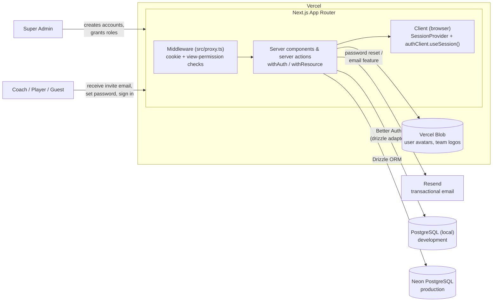
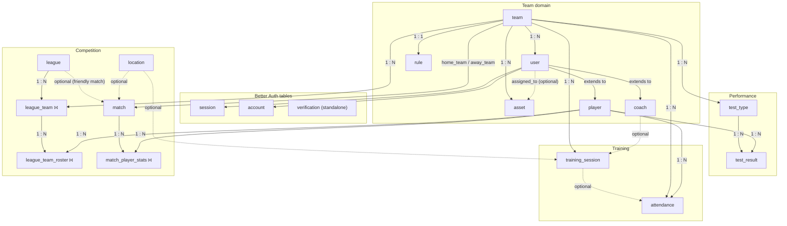
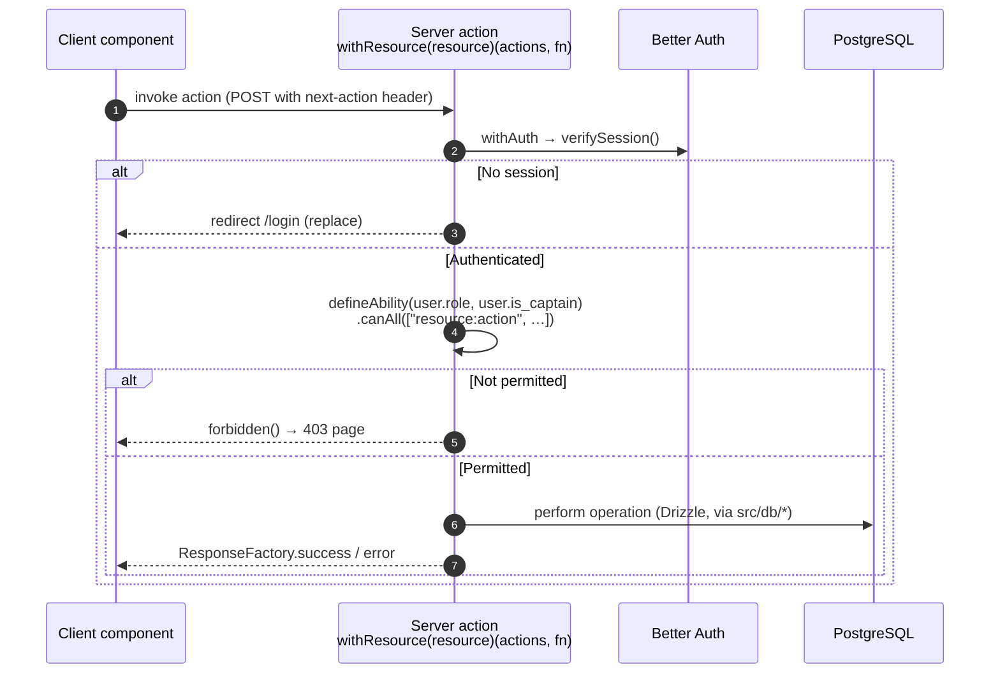
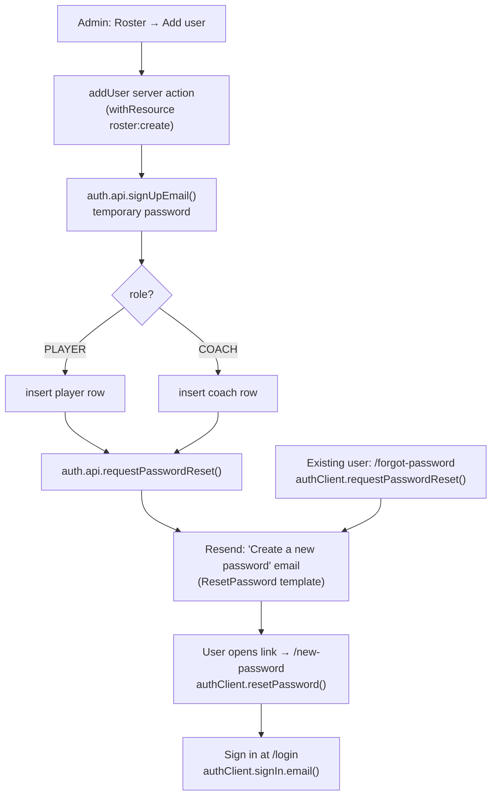

# Architecture — Saigon Rovers Basketball Club Portal

> Official architecture document for `saigon-rovers-basketball-club-portal`. Everything here is generated from the **actual source code** — schema in `src/drizzle/schema/`, auth in `src/lib/auth.ts` + `src/proxy.ts` + `src/actions/auth.ts`, permissions in `src/utils/permissions.ts`. Where the code doesn't answer a question, the section says so explicitly. This is not a README — for setup steps see [README.md](README.md) and [DEVELOPMENT.md](DEVELOPMENT.md).

**Contents**

1. [System overview](#1-system-overview)
2. [Tech stack](#2-tech-stack)
3. [Directory structure](#3-directory-structure)
4. [Entity relationship overview](#4-entity-relationship-overview)
5. [Database relationships (detailed ERD)](#5-database-relationships-detailed-erd)
6. [Authentication & authorization](#6-authentication--authorization)
7. [Key modules / features](#7-key-modules--features)
8. [External services](#8-external-services)
9. [Configuration & environments](#9-configuration--environments)
10. [Cross-cutting concerns](#10-cross-cutting-concerns)
11. [Build, test & deploy](#11-build-test--deploy)
12. [Known gaps / risks](#12-known-gaps--risks)
13. [Security considerations](#13-security-considerations)
14. [Development environment & tooling](#14-development-environment--tooling)
15. [Future considerations / roadmap](#15-future-considerations--roadmap)
16. [Project identification](#16-project-identification)
17. [Glossary / acronyms](#17-glossary--acronyms)

---

## 1. System overview

A team-management portal for a basketball club: an admin provisions accounts, and coaches/players/guests manage roster, training, attendance, matches, performance testing, assets, and analytics. It is a **Next.js 16 App Router** application deployed to **Vercel**, with all mutations flowing through **React Server Actions** rather than a REST API. There is **no public sign-up** — accounts are created by an admin (or a team captain) and activated through a password-reset email.



- **Hosting** — the Next.js app deploys to Vercel; the database is local PostgreSQL in development and [Neon](https://vercel.com/marketplace/neon) in production (same Drizzle schema, `drizzle.config.ts`).
- **Files** — user avatars and team logos are stored in **Vercel Blob** (`src/lib/blob.ts`, private access, path scheme `users/<id>` and `teams/<team_id>`).
- **Email** — **Resend** (`src/lib/resend.ts`) sends the password-setup email during account provisioning and powers the Emails / analytics-report feature.
- **Auth** — **Better Auth** (`better-auth/minimal` + `@better-auth/infra` `dash()` plugin) with the Drizzle adapter; email/password only, no self-signup.
- **Rendering** — pages are React Server Components; interactivity lives in colocated `_components` client components. There is no separate API tier — server actions (`src/actions/*`) are the write path, and two route handlers exist for Better Auth and for PDF report export.

---

## 2. Tech stack

| Layer                  | Technology                                      | Version                | Where configured                               |
| ---------------------- | ----------------------------------------------- | ---------------------- | ---------------------------------------------- |
| Language               | TypeScript                                      | `^6.0.3`               | `tsconfig.json` (strict, `@/*` path aliases)   |
| Framework              | Next.js (App Router)                            | `16.2.10`              | `next.config.ts`                               |
| UI runtime             | React / React DOM                               | `19.2.7`               | `package.json`                                 |
| Component library      | Chakra UI v3 + Emotion                          | `^3.36.0`              | `src/providers/chakra.tsx` (primary `#8c271e`) |
| Icons                  | lucide-react                                    | `^1.23.0`              | `src/app/(protected)/_helpers/utils.ts`        |
| Charts                 | Recharts + `@chakra-ui/charts`                  | `^3.9.2` / `^3.36.0`   | dashboard `_components`                        |
| Rich text              | Tiptap                                          | `^3.27.1`              | team-rule `RuleEditor`, `TextEditor`           |
| Auth                   | Better Auth (`/minimal`) + `@better-auth/infra` | `^1.6.23` / `^0.3.6`   | `src/lib/auth.ts`, `src/lib/auth-client.ts`    |
| ORM                    | Drizzle ORM + drizzle-kit                       | `^0.45.2` / `^0.31.10` | `drizzle.config.ts`, `src/drizzle/`            |
| DB driver              | `pg` (node-postgres)                            | `^8.22.0`              | `src/drizzle/index.ts` (`Pool({ max: 1 })`)    |
| Database               | PostgreSQL (local) / Neon (prod)                | —                      | `env.DATABASE_URL`                             |
| File storage           | `@vercel/blob`                                  | `^2.6.1`               | `src/lib/blob.ts`                              |
| Email                  | `resend`                                        | `^6.17.1`              | `src/lib/resend.ts`                            |
| Server PDF             | `puppeteer-core` + `@sparticuz/chromium-min`    | `^25.3.0` / `^149`     | `src/lib/puppeteer.ts`                         |
| Client PDF             | `pdf-lib` + `@pdf-lib/fontkit`                  | `^1.17.1`              | `registration/_helpers/pdf.ts`                 |
| Forms                  | react-hook-form + `@hookform/resolvers`         | `^7.80.0`              | feature `_components`                          |
| Validation             | Zod                                             | `^4.4.3`               | `src/schemas/*`, `env.config.ts`               |
| URL state              | nuqs                                            | `^2.9.0`               | `src/lib/nuqs.ts`, root layout `NuqsAdapter`   |
| Data fetching (client) | SWR                                             | `^2.4.2`               | `src/hooks/use-image.ts`                       |
| Utilities              | es-toolkit, date-fns, `@date-fns/tz`            | —                      | `src/utils/*`                                  |
| Analytics              | Vercel Analytics + Speed Insights               | `^2`                   | `src/app/layout.tsx` (production only)         |
| Unit testing           | Vitest + Testing Library + jest-axe             | `^4.1.9`               | `vitest.config.mts`, `test/setup.ts`           |
| E2E testing            | Playwright                                      | `^1.61.1`              | `playwright.config.ts`, `e2e/`                 |
| Package manager        | pnpm (workspace)                                | —                      | `pnpm-workspace.yaml`                          |

---

## 3. Directory structure

```
team-management/
├── src/
│   ├── app/                    # Next.js App Router (route groups do not add URL segments)
│   │   ├── (auth)/             # Public auth pages: /login, /forgot-password, /new-password
│   │   ├── (protected)/        # Authenticated app — gated by layout.tsx (verifySession)
│   │   │   ├── (overview)/     #   /dashboard, /team-rule (+ reports/_components, no route)
│   │   │   ├── (performance)/  #   /periodic-testing (+ /add-result, /test-types)
│   │   │   ├── (resources)/    #   /assets, /emails
│   │   │   ├── (settings)/     #   /teams, /leagues, /locations
│   │   │   ├── (team-management)/  # /roster, /training, /attendance, /registration, /matches
│   │   │   ├── profile/[id]/   #   dynamic user profile
│   │   │   ├── _components/     #   AppShell, Header, Sidebar, Breadcrumbs, AccountMenu
│   │   │   └── _helpers/        #   SIDEBAR_GROUP nav config, segmentToLabel
│   │   ├── (system)/forbidden/ # /forbidden → triggers Next.js forbidden() boundary
│   │   ├── api/
│   │   │   ├── auth/[...all]/   #   Better Auth catch-all (GET, POST)
│   │   │   └── reports/dashboard/  # POST → Puppeteer-rendered PDF of the dashboard
│   │   ├── layout.tsx          # Root layout: Nuqs → Chakra → Toaster (+ Vercel analytics)
│   │   └── forbidden.tsx       # 403 UI boundary
│   ├── actions/                # 'use server' write path — one file per domain, permission-guarded
│   ├── db/                     # Data-access layer — db.query.* per domain + pg-error mapping
│   ├── drizzle/                # Schema, migrations, seed SQL, migrate/reset scripts, db instance
│   │   ├── schema/             #   12 modules → 19 tables + PG enums
│   │   ├── migrations/         #   4 generated migrations + snapshots
│   │   ├── scripts/            #   migrate.ts, reset.ts
│   │   └── sql/                #   raw seed/bootstrap SQL (default team, admin, mock data)
│   ├── schemas/                # Zod input-validation schemas (one per domain)
│   ├── lib/                    # auth, auth-client, blob, resend, puppeteer, nuqs, zod, download
│   ├── hooks/                  # use-permissions, use-image, use-table-state, use-synced-state
│   ├── providers/              # session.tsx (SessionProvider), chakra.tsx (UiProvider)
│   ├── components/             # Shared UI: DataTable, TextField, SearchableSelect, ui/, filters/
│   ├── utils/                  # enum, constant, permissions, response, formatter, helper, type
│   ├── types/                  # shared TS types
│   ├── routes.ts               # LOGIN_PATH, AUTH/PUBLIC_ROUTES, DEFAULT_LOGIN_REDIRECT, RESOURCES
│   └── proxy.ts                # Next.js middleware (cookie presence + view-permission gate)
├── e2e/                        # Playwright specs + auth storage-state setup
├── test/                       # Vitest setup, mocks, render utilities, db-operation mocks
├── docs/prd/                   # Product Requirements Docs (stitched into a PDF)
├── scripts/                    # build-prd-pdf.mjs, prd-pdf.css
├── .github/workflows/          # production, preview, playwright (disabled), prd-pdf
├── env.config.ts               # Zod-validated env loader (default export `@env`)
├── drizzle.config.ts           # drizzle-kit config (postgresql, snake_case)
├── next.config.ts / tsconfig.json / vitest.config.mts / playwright.config.ts
```

> Route groups in parentheses (`(protected)`, `(team-management)`, …) organize files **without** adding URL segments — `(protected)/(team-management)/roster` resolves to `/roster`.

---

## 4. Entity relationship overview

High-level view of every entity and how the domains connect. Junction tables are marked `⨝`; `player` and `coach` **extend** `user` (shared primary key).



Structural notes:

- There is only **one** `session` table (Better Auth) — it belongs to `user`, not to `team`.
- `verification` is a standalone Better Auth table (password-reset tokens); it has no foreign keys.
- `league_team` (league ⨯ team) is a junction table in its own right; `league_team_roster` adds the player dimension.
- A `match` references **two** teams directly (`home_team` / `away_team`, must differ) — teams are not linked to matches only through the league.
- `test_result` links to **both** `test_type` and `player`.
- `location` is used by both `match` and `training_session`.

---

## 5. Database relationships (detailed ERD)

All 19 tables from `src/drizzle/schema/` (barrel: `src/drizzle/schema.ts`, 12 modules). Every table also carries `created_at` / `updated_at` (from `src/drizzle/helpers.ts`, omitted below for brevity). PostgreSQL enums back the `*_enum` columns (`src/utils/enum.ts`). Casing is `snake_case` (`drizzle.config.ts`).

```mermaid
erDiagram
    %% ===== Better Auth =====
    user {
        text id PK
        text name
        text email UK
        boolean email_verified
        text image "Vercel Blob path"
        uuid team_id FK
        date dob
        varchar phone_number
        varchar citizen_identification
        user_state state "ACTIVE | INACTIVE | TEMPORARILY_ABSENT | UNKNOWN"
        user_role role "SUPER_ADMIN | COACH | PLAYER | GUEST"
        date join_date
        date leave_date
    }
    session {
        text id PK
        text token UK
        timestamp expires_at
        text ip_address
        text user_agent
        text user_id FK
    }
    account {
        text id PK
        text account_id
        text provider_id "credential"
        text user_id FK
        text password "hashed"
        text access_token
        text refresh_token
    }
    verification {
        text id PK
        text identifier
        text value
        timestamp expires_at
    }

    %% ===== Team domain =====
    team {
        uuid team_id PK
        boolean is_default "unique partial index: only one default"
        varchar name
        varchar email UK
        integer establish_year "check: 2000..current year"
        text image "Vercel Blob path"
    }
    rule {
        uuid rule_id PK
        uuid team_id FK,UK "1:1 with team"
        text content
    }
    asset {
        uuid asset_id PK
        uuid team_id FK
        varchar name UK
        text assigned_to FK "nullable -> user"
        date acquired_date
        asset_catogory category "PG enum name is misspelled"
        integer quantity
        asset_condition condition
        varchar note
    }
    player {
        text id PK,FK "= user.id (extends user)"
        boolean is_captain
        integer jersey_number UK "check: 0..99"
        player_position position
        integer height "check: 0..200"
        integer weight "check: 0..100"
    }
    coach {
        text id PK,FK "= user.id (extends user)"
        coach_position position
    }

    %% ===== Competition =====
    league {
        uuid league_id PK
        varchar name UK
        date start_date
        date end_date
        league_status status
        varchar description
    }
    league_team {
        uuid league_id PK,FK
        uuid team_id PK,FK
    }
    league_team_roster {
        uuid league_id PK,FK
        uuid team_id PK,FK
        text player_id PK,FK
    }
    location {
        uuid location_id PK
        varchar name
        varchar address
    }
    match {
        uuid match_id PK
        boolean is_5x5 "5x5 or 3x3"
        uuid league_id FK "nullable -> friendly match"
        uuid location_id FK "nullable"
        uuid home_team FK "check: home != away"
        uuid away_team FK
        date date
        time time
        integer home_team_score
        integer away_team_score
    }
    match_player_stats {
        uuid match_id PK,FK
        text player_id PK,FK
        integer points_scored
        integer rebounds
        integer assists
        integer steals
        integer blocks
        integer turnovers
        integer fouls
        integer minutes_played
    }

    %% ===== Training =====
    training_session {
        uuid session_id PK
        uuid team_id FK
        text coach_id FK "nullable"
        uuid location_id FK "nullable"
        date date
        time start_time
        time end_time
        session_status status
    }
    attendance {
        uuid attendance_id PK
        uuid team_id FK
        text player_id FK
        uuid session_id FK "nullable"
        attendance_status status
        date date "unique (player_id, date)"
        varchar reason
    }

    %% ===== Performance =====
    test_type {
        uuid type_id PK
        uuid team_id FK
        varchar name "unique (team_id, name)"
        test_type_unit unit
    }
    test_result {
        uuid result_id PK
        text player_id FK
        uuid type_id FK "on delete: restrict"
        decimal result
        date date
    }

    %% ===== Relationships =====
    user ||--o{ session : "has"
    user ||--o{ account : "has"

    team ||--o{ user : "has members"
    team ||--o| rule : "has one"
    team ||--o{ asset : "owns"
    user |o--o{ asset : "assigned_to"
    user ||--o| player : "extends to"
    user ||--o| coach : "extends to"

    league ||--o{ league_team : "includes"
    team ||--o{ league_team : "joins"
    league ||--o{ league_team_roster : ""
    team ||--o{ league_team_roster : ""
    player ||--o{ league_team_roster : "registered in"

    league |o--o{ match : "schedules (null = friendly)"
    location |o--o{ match : "hosts"
    team ||--o{ match : "home_team"
    team ||--o{ match : "away_team"
    match ||--o{ match_player_stats : "records"
    player ||--o{ match_player_stats : "performs"

    team ||--o{ training_session : "schedules"
    coach |o--o{ training_session : "leads"
    location |o--o{ training_session : "hosts"
    training_session |o--o{ attendance : "tracked by"
    team ||--o{ attendance : ""
    player ||--o{ attendance : "checks in"

    team ||--o{ test_type : "defines"
    test_type ||--o{ test_result : "measured as"
    player ||--o{ test_result : "achieves"
```



### Foreign-key delete behavior

| Child column                                                                                                                                                    | References                                         | On delete                                                    |
| --------------------------------------------------------------------------------------------------------------------------------------------------------------- | -------------------------------------------------- | ------------------------------------------------------------ |
| `user.team_id`, `rule.team_id`, `asset.team_id`, `test_type.team_id`, `training_session.team_id`, `attendance.team_id`, `league_team.*`, `league_team_roster.*` | `team` / `league` / `player`                       | **cascade**                                                  |
| `session.user_id`, `account.user_id`, `player.id`, `coach.id`                                                                                                   | `user`                                             | **cascade**                                                  |
| `attendance.player_id`, `match_player_stats.player_id`, `test_result.player_id`, `match.league_id`, `match_player_stats.match_id`                               | `player` / `league` / `match`                      | **cascade**                                                  |
| `asset.assigned_to`, `attendance.session_id`, `match.location_id`, `training_session.coach_id`, `training_session.location_id`                                  | `user` / `training_session` / `location` / `coach` | **set null**                                                 |
| `test_result.type_id`                                                                                                                                           | `test_type`                                        | **restrict** (guarded in `removeTestType`, migration `0002`) |
| `match.home_team`, `match.away_team`                                                                                                                            | `team`                                             | **no action** (default)                                      |

### Migrations & seed

`src/drizzle/migrations/` (dialect postgresql, 4 migrations): `0000_base_tables`, `0001_update_asset_table` (adds `OBSOLETE`, `assigned_to`, `acquired_date`), `0002_complete_doctor_doom` (recreates `test_result.type_id` FK as `ON DELETE restrict`), `0003_update_team_image` (renames `team.logo_url` → `team.image`, to `text`). Raw bootstrap/seed SQL lives in `src/drizzle/sql/` (`team.sql` default team, `admin_user.sql`, `team_rule.sql`, `periodic-testing.sql`, and `seed_data.sql` — a re-runnable mock-data importer targeting 20 teams / 100 users / 100 rows per domain).

---

## 6. Authentication & authorization

Better Auth (email & password, **no** email verification) with a **three-layer** defense: middleware → server → client. Session lifetime is **1 hour** (`COOKIE.expires`), the signed cookie cache also lasts 1 hour (`COOKIE.maxAge`), cookie prefix `sgr` (`src/utils/constant.ts:31`). Config: `src/lib/auth.ts` (`betterAuth`, plugins `dash()` + `nextCookies()`, `additionalFields` role/state/team_id/is_captain). Client: `src/lib/auth-client.ts` (`createAuthClient` + `inferAdditionalFields`).

### 6.1 Roles & permission model (`src/utils/permissions.ts`)

- **Roles** (`UserRole`): `SUPER_ADMIN`, `COACH`, `PLAYER`, `GUEST`.
- **Resources** (16, `src/routes.ts:30`): `assets`, `attendance`, `dashboard`, `documents`, `emails`, `leagues`, `locations`, `matches`, `periodic-testing`, `profile`, `registration`, `roster`, `reports`, `team-rule`, `teams`, `training`.
- **Actions**: `view`, `create`, `edit`, `delete`. A `Permission` is the string `"<resource>:<action>"`.
- `ROLE_CONFIG` maps role → allowed actions per resource. `SUPER_ADMIN` gets all actions on all resources; `COACH`, `PLAYER`, `GUEST` get progressively narrower sets.
- `CAPTAIN_PERMISSIONS` grants a **player who is captain** extra rights (`team-rule:edit`, `roster:create/edit/delete`, `matches:create/edit`, `registration:create/edit`, full `periodic-testing`).
- `can(role, resource, action, isCaptain?)` is the single decision function; `defineAbility(role, isCaptain)` returns `{ can, canAll, canAny }`. The client mirror is `usePermissions()` (`src/hooks/use-permissions.ts`).

### 6.2 Request lifecycle (page navigation)

```mermaid
sequenceDiagram
    autonumber
    actor U as Browser
    participant MW as Middleware<br/>(src/proxy.ts)
    participant RSC as Protected layout / page<br/>((protected)/layout.tsx)
    participant BA as Better Auth<br/>(auth.api)
    participant DB as PostgreSQL

    U->>MW: GET /roster (navigation)
    Note over MW: Requests with a next-action header bypass<br/>middleware — server actions guard themselves

    MW->>MW: getSessionCookie() — presence check only, no DB
    alt No cookie + protected route
        MW-->>U: redirect /login
    else Cookie + auth route (/, /login, /forgot-password, /new-password)
        MW-->>U: redirect /dashboard
    else Cookie + protected route
        MW->>MW: getCookieCache() — verify signed cookie cache<br/>(maxAge 1 h, still no DB)
        alt Cookie cache expired / invalid
            MW-->>U: redirect /login
        else Valid
            MW->>MW: resolveResource(pathname)<br/>can(role, resource, 'view')
            alt Lacks view permission
                MW-->>U: redirect /forbidden
            else Allowed
                MW->>RSC: NextResponse.next()
            end
        end
    end

    RSC->>BA: verifySession() — React cache, once per request
    BA->>DB: auth.api.getSession() (session row, expiresIn = 1 h)
    alt No session (expired / revoked)
        RSC-->>U: redirect /login (replace)
    else Valid session
        RSC-->>U: render page wrapped in SessionProvider(initialSession)
    end

    Note over U: authClient.useSession() keeps the session fresh on the client;<br/>AppShell also redirects to /login if the client resolves unauthenticated
```

### 6.3 Server actions

Server actions skip the middleware (the `next-action` header bypass) and are guarded individually via `withAuth` / `withResource` (`src/actions/auth.ts`):



- The **middleware** permission check covers **`view` only**; granular `create`/`edit`/`delete` checks happen in server actions via `withResource`, which also honors **captain** overrides.
- `getCookieCache()` never touches the database — full validation against the `session` table happens in `verifySession()` (`cache()`-wrapped, once per request) on the server.
- The client `SessionProvider` does not poll; a missing-session redirect is done server-side by the protected layout and, as a fallback, client-side in `AppShell`.

### 6.4 Account provisioning & password reset

There is **no public sign-up**. Admins (or captains with `roster:create`) provision accounts from the Roster page (`addUser` in `src/actions/user.ts`):



---

## 7. Key modules / features

Each feature is a Server Component page under `src/app/(protected)/…` whose interactivity lives in a colocated `_components/` folder; writes go through the matching `src/actions/*` file (permission resource in **bold**), and reads through `src/db/*`. Pages are permission-gated for `view` in `src/proxy.ts`; finer actions are gated in the action.

| Feature          | URL                                                  | Page                             | Actions file                     | Resource                 | Touches                                                  |
| ---------------- | ---------------------------------------------------- | -------------------------------- | -------------------------------- | ------------------------ | -------------------------------------------------------- |
| Login / reset    | `/login`, `/forgot-password`, `/new-password`        | `(auth)/*/page.tsx`              | `auth.ts` (helpers)              | public                   | `user`, `account`, `verification`, `session`             |
| Dashboard        | `/dashboard`                                         | `(overview)/dashboard`           | `analytics.ts`                   | **dashboard**            | player, match, training_session, attendance              |
| Team rule        | `/team-rule`                                         | `(overview)/team-rule`           | `rule.ts`                        | **team-rule**            | `rule`                                                   |
| Roster           | `/roster`                                            | `(team-management)/roster`       | `user.ts`                        | **roster**               | `user`, `player`, `coach` (+ Better Auth signup, Resend) |
| Training         | `/training`                                          | `(team-management)/training`     | `training-session.ts`            | **training**             | `training_session`, coach                                |
| Attendance       | `/attendance`                                        | `(team-management)/attendance`   | `attendance.ts`                  | **attendance**           | `attendance`                                             |
| Registration     | `/registration`                                      | `(team-management)/registration` | `league.ts` (roster sync)        | **registration**         | `league_team_roster` (+ client PDF via `pdf-lib`)        |
| Matches          | `/matches`                                           | `(team-management)/matches`      | `match.ts`                       | **matches**              | `match`, `match_player_stats`                            |
| Periodic testing | `/periodic-testing` (+ `/add-result`, `/test-types`) | `(performance)/periodic-testing` | `test-result.ts`, `test-type.ts` | **periodic-testing**     | `test_result`, `test_type`                               |
| Assets           | `/assets`                                            | `(resources)/assets`             | `asset.ts`                       | **assets**               | `asset`                                                  |
| Emails / report  | `/emails`                                            | `(resources)/emails`             | `report.ts`                      | **emails** / **reports** | recipients query + Resend + Puppeteer PDF                |
| Teams            | `/teams`                                             | `(settings)/teams`               | `team.ts`                        | **teams**                | `team` (+ logo in Blob)                                  |
| Leagues          | `/leagues`                                           | `(settings)/leagues`             | `league.ts`                      | **leagues**              | `league`, `league_team_roster`                           |
| Locations        | `/locations`                                         | `(settings)/locations`           | `location.ts`                    | **locations**            | `location`                                               |
| Profile          | `/profile/[id]`                                      | `(protected)/profile/[id]`       | `user.ts`                        | **profile**              | `user`, `player`, `coach` (+ avatar in Blob)             |
| Forbidden        | `/forbidden`                                         | `(system)/forbidden`             | —                                | —                        | triggers `forbidden()` 403 boundary                      |

**App shell** (`(protected)/_components/AppShell.tsx`) provides the Header / Sidebar / Breadcrumbs chrome and a client-side auth fallback. The sidebar is driven by `SIDEBAR_GROUP` (`_helpers/utils.ts`), which groups resources into Overview / Team Management / Performance / Resources / Settings; `documents` is present but `disabled`.

**API route handlers** (the only non-action server endpoints):

- `src/app/api/auth/[...all]/route.ts` — Better Auth catch-all (`toNextJsHandler`, `GET`/`POST`): sign-in, sign-out, session, password reset.
- `src/app/api/reports/dashboard/route.ts` — `POST`, `maxDuration = 30`. Auth-gated (401 if no session); launches headless Chromium (`getBrowser`), **forwards the request's auth cookies** into the browser, navigates to the origin, isolates `#reports-dashboard`, and returns an `application/pdf` attachment.

---

## 8. External services

| Service                           | Purpose                               | Config file                                 | Env vars                                                       |
| --------------------------------- | ------------------------------------- | ------------------------------------------- | -------------------------------------------------------------- |
| Vercel (hosting)                  | App deploy (preview + production)     | `.github/workflows/*.yaml`                  | `VERCEL_TOKEN`, `VERCEL_ORG_ID`, `VERCEL_PROJECT_ID`           |
| PostgreSQL / Neon                 | Primary database                      | `src/drizzle/index.ts`, `drizzle.config.ts` | `DATABASE_URL`                                                 |
| Better Auth                       | Authentication (email/password)       | `src/lib/auth.ts`                           | `BETTER_AUTH_URL`, `BETTER_AUTH_SECRET`, `BETTER_AUTH_API_KEY` |
| Vercel Blob                       | Private file storage (avatars, logos) | `src/lib/blob.ts`                           | `BLOB_READ_WRITE_TOKEN`, `BLOB_STORE_ID`                       |
| Resend                            | Transactional email                   | `src/lib/resend.ts`                         | `RESEND_API_KEY`                                               |
| Chromium pack                     | Serverless headless browser for PDF   | `src/lib/puppeteer.ts`                      | `CHROMIUM_PACK_URL` (production)                               |
| Vercel Analytics + Speed Insights | Web analytics (production only)       | `src/app/layout.tsx`                        | —                                                              |

Notes: `BLOB_STORE_ID`, `BETTER_AUTH_*`, and `CRON_SECRET` appear in `.env` but are **not** part of the validated `env.config.ts` schema — Better Auth reads its own vars directly from `process.env`. Resend's sender is currently `Acme <onboarding@resend.dev>` (`src/lib/resend.ts:7`) with every subject prefixed `SGR - `. `next.config.ts` allowlists remote images from `https://blob.vercel-storage.com/**`.

---

## 9. Configuration & environments

Environment variables are loaded and **Zod-validated** in `env.config.ts` (imported everywhere as `@env`); most default to `''`/localhost so Vercel builds don't fail on a missing var.

| Var                                        | Validated in `env.config.ts`            | Purpose                                               |
| ------------------------------------------ | --------------------------------------- | ----------------------------------------------------- |
| `NODE_ENV`                                 | ✅ enum, default `development`          | environment switch                                    |
| `CI`                                       | ✅ boolean, default `false`             | Playwright reporter / server reuse                    |
| `DEV_URL`                                  | ✅ url, default `http://localhost:3000` | dev base URL, `trustedOrigins`, Playwright `baseURL`  |
| `PRODUCTION_URL`                           | ✅ url                                  | production base URL, `trustedOrigins`                 |
| `DATABASE_URL`                             | ✅ string                               | Postgres connection (`pg.Pool`)                       |
| `RESEND_API_KEY`                           | ✅ string                               | Resend client                                         |
| `BLOB_READ_WRITE_TOKEN`                    | ✅ string                               | Vercel Blob writes                                    |
| `CHROMIUM_PACK_URL`                        | ✅ string                               | production Chromium binary                            |
| `PW_USERNAME` / `PW_PASSWORD`              | ✅ string                               | Playwright admin login                                |
| `BETTER_AUTH_URL` / `_SECRET` / `_API_KEY` | ❌ (read by Better Auth directly)       | auth signing/config                                   |
| `BLOB_STORE_ID`                            | ❌                                      | Blob store id                                         |
| `CRON_SECRET`                              | ❌                                      | present in `.env`; **no cron consumer found in code** |

**Dev vs prod differences** derived from code:

- **Database** — local PostgreSQL in dev, Neon in prod (same schema).
- **Chromium** — dev drives system Chrome (`channel: 'chrome'`); prod fetches a Brotli Chromium pack from `CHROMIUM_PACK_URL` (`src/lib/puppeteer.ts`).
- **Analytics** — Vercel Analytics + Speed Insights render only when `NODE_ENV === 'production'` (`src/app/layout.tsx`).
- **Error detail** — the reports route returns the raw error message only in development, a generic message otherwise (`api/reports/dashboard/route.ts`).

---

## 10. Cross-cutting concerns

- **Input validation** — Zod schemas in `src/schemas/*` (one per domain), consumed by react-hook-form via `@hookform/resolvers` on the client and re-validated inside actions. `src/lib/zod.ts` provides `getDefaults()` (pull `ZodDefault` values into form defaults) and a dev `onError` logger.
- **Authorization** — centralized in `src/utils/permissions.ts` (`can` / `defineAbility`), enforced at three layers (middleware view-gate, server-action `withResource`, client `usePermissions`/`Authorized`/`Visibility` components). See §6.
- **Response shape** — server actions return `ResponseFactory.success(message, data?)` / `ResponseFactory.error(message)` (`src/utils/response.ts`) — a uniform `{ success, message, data? }` envelope.
- **Database errors** — `src/db/pg-error.ts` maps Postgres SQLSTATE codes (`PgErrorCode`) to user-friendly messages via `getDbErrorMessage()`, unwrapping `DrizzleQueryError` → `pg.DatabaseError`. Actions catch specific constraint names (e.g. `unique_player_per_date`, `player_jersey_number_unique`, the `test_result → test_type` FK) to return friendly errors.
- **Caching / revalidation** — `src/actions/cache.ts` exposes a `revalidate` map calling `revalidatePath()` per entity after mutations. `CACHE_TAG`-based `revalidateTag` is scaffolded but currently commented out. Client reads use SWR (`use-image.ts` uses `useSWRImmutable`); URL state uses **nuqs** (`src/lib/nuqs.ts`) with per-resource param parsers, client hooks (`useRosterFilters`, …) and server loaders (`loadMatchFilters`, …).
- **File uploads** — `src/lib/blob.ts` (`getFile`/`uploadFile`/`deleteFile`): private access, `addRandomSuffix: true`; uploads replace and then delete the previous blob. `getFile` returns a base64 `data:` URL. Paths: `users/<id>` (avatars), `teams/<team_id>` (logos).
- **PDF generation** — two paths: server-side dashboard export via Puppeteer (`src/lib/puppeteer.ts` + reports route), and client-side registration forms via `pdf-lib` + `@pdf-lib/fontkit` (`registration/_helpers/pdf.ts`, with AcroForm field auto-mapping and CSV export).
- **Styling / theming** — Chakra UI v3 with a custom system (primary `#8c271e`) in `src/providers/chakra.tsx`; Emotion SSR via `useServerInsertedHTML`. Toaster and shared primitives in `src/components/ui/`.
- **Accessibility** — jest-axe is wired into the test harness (`toHaveNoViolations`, custom `axeInteractiveStat` helper) so components are checked for a11y violations in unit tests.

---

## 11. Build, test & deploy

**Scripts** (`package.json`): `dev`, `build`, `analyze`; DB — `db:generate`, `db:migrate` (`tsx src/drizzle/scripts/migrate.ts`), `db:reset`, `db:drop`, `db:studio`; testing — `test` (Vitest), `test:ui`, `e2e` (Playwright), `e2e:ui`.

**Testing**

- **Unit (Vitest)** — jsdom environment, `test/setup.ts` mocks Next.js (`next/headers`, `next/navigation`, `next/image`, `next/cache`), Chakra browser APIs, Resend, nuqs, and Drizzle operators so `db/` modules run without a real database. **118** colocated `*.test.ts(x)` files; `test/db-operations.ts` provides chainable Drizzle mock factories and `test/mocks/` holds per-domain fixtures. Coverage excludes UI primitives, drizzle, schemas, providers, and auth libs (`vitest.config.mts`).
- **E2E (Playwright)** — `testDir: e2e`, projects `auth` (unauthenticated) and `admin` (depends on a `setup` project that logs in with `PW_USERNAME`/`PW_PASSWORD` and saves storage state to `playwright/.auth/admin.json`). Specs: `e2e/auth/login.spec.ts`, `e2e/resources/assets.spec.ts` (full CRUD). `webServer` runs `pnpm dev`.

**CI/CD (`.github/workflows/`)**

| Workflow          | Trigger                                                      | Does                                                                                                               |
| ----------------- | ------------------------------------------------------------ | ------------------------------------------------------------------------------------------------------------------ |
| `preview.yaml`    | PR → `main`                                                  | `unit-test` (`pnpm test`) → gated `build-and-deploy` to **Vercel preview**                                         |
| `production.yaml` | push → `main`                                                | `vercel pull/build --prod/deploy --prod` to **Vercel production** (⚠️ no test gate)                                |
| `playwright.yml`  | PR → `main`                                                  | E2E job — **currently disabled** (`if: ${{ false }}`) pending an isolated test DB                                  |
| `prd-pdf.yml`     | manual / push / PR touching `docs/prd/**` or the PRD scripts | isolated `md-to-pdf@5` install → `node scripts/build-prd-pdf.mjs` → uploads `sgr-team-management-prd.pdf` artifact |

**PRD PDF pipeline** — `scripts/build-prd-pdf.mjs` stitches the ordered `MANIFEST` of markdown files under `docs/prd/` into one document (cover + page breaks), then renders it to `sgr-team-management-prd.pdf` via `md-to-pdf` (Puppeteer/Chromium) using `scripts/prd-pdf.css`. `md-to-pdf` is installed in an isolated `.prd-tools/` and symlinked into `scripts/node_modules` to avoid disturbing the app's pnpm deps.

**Hosting** — Vercel (Next.js 16). `next.config.ts` keeps `puppeteer-core` and `@sparticuz/chromium-min` as `serverExternalPackages`, tunes image `deviceSizes`/`imageSizes`/`formats`, and enables `experimental.authInterrupts` + `optimizePackageImports: ['@chakra-ui/react']`.

---

## 12. Known gaps / risks

- **Production deploy has no test gate.** `preview.yaml` runs `pnpm test` before deploying, but `production.yaml` (push to `main`) deploys straight to production with no unit-test step. A failing test can ship to prod.
- **E2E tests are disabled in CI** (`playwright.yml` → `if: ${{ false }}`), pending an isolated test database. Regressions in end-to-end flows won't be caught automatically.
- **Misspelled Postgres enum** — the asset category enum is registered as `asset_catogory` (`src/drizzle/schema/asset.ts`). It works, but renaming later requires a migration.
- **`CRON_SECRET` is defined but unused** — it appears in `.env` with no consumer in the codebase (no `vercel.json` cron, no scheduled route). The `ReportTrigger.SCHEDULED` enum value exists but no scheduler was found; report sending is currently manual.
- **Default Resend sender** — emails are sent from `Acme <onboarding@resend.dev>` (`src/lib/resend.ts:7`), the Resend sandbox identity, not a club-branded verified domain.
- **Auth `additionalFields` comments are swapped** — in `src/lib/auth.ts` the inline comments on `state`/`role` reference the wrong enum (cosmetic only; the `type`/`defaultValue` are correct).
- **Single DB connection** — `Pool({ max: 1 })` (`src/drizzle/index.ts`) is intentional for serverless but caps concurrency per instance; worth revisiting if moving off serverless.
- **`documents` resource is scaffolded but disabled** — present in `RESOURCES` and the sidebar (`disabled: true`) with no route/page.
- **Middleware view-gate is prefix-based** — `resolveResource` matches by `pathname.startsWith('/<resource>')`; a new route whose prefix collides with a resource name could be gated unexpectedly.

---

## 13. Security considerations

| Aspect | Implementation | Where |
| --- | --- | --- |
| Authentication | Better Auth email/password, **no email verification**, **no public sign-up** (admin-provisioned) | `src/lib/auth.ts` |
| Password reset | Token-based, delivered by Resend; tokens stored in the `verification` table | `auth.ts` `sendResetPassword`, `verification` table |
| Session | Signed cookie (prefix `sgr`), 1 h expiry + 1 h cookie cache; server validation via `auth.api.getSession()` | `src/utils/constant.ts`, `src/actions/auth.ts` |
| Password storage | Hashed by Better Auth, stored in `account.password` | `account` table |
| Authorization | RBAC — `can()` / `defineAbility()` over `<resource>:<action>` permissions, plus captain overrides | `src/utils/permissions.ts` |
| Defense-in-depth | 3 layers: middleware (view-gate) → server action (`withResource`) → client (`usePermissions`) | `src/proxy.ts`, `src/actions/auth.ts` |
| CSRF / origin | `trustedOrigins` restricted to `DEV_URL` + `PRODUCTION_URL` | `src/lib/auth.ts:32` |
| File access | Vercel Blob objects are **private** (`access: 'private'`), fetched server-side and returned as base64 data URLs | `src/lib/blob.ts` |
| Transport / at-rest encryption | TLS in transit and at-rest encryption are provided by the managed platforms (Vercel, Neon, Vercel Blob, Resend); not configured in application code | > Not Found in repo (platform-managed) |
| Secrets | Env vars validated by Zod (`env.config.ts`); auth secrets read directly from `process.env`; CI secrets via GitHub Actions | `env.config.ts`, `.github/workflows/*` |

Notable boundary: the PDF report route (`api/reports/dashboard`) **forwards the caller's auth cookies** into a headless Chromium instance so protected pages render — it is auth-gated (401 without a session), but the cookie-forwarding is a trust boundary worth keeping in mind.

## 14. Development environment & tooling

- **Local setup** — see [README.md](README.md) and [DEVELOPMENT.md](DEVELOPMENT.md). Package manager is **pnpm**; run `pnpm dev` (Next dev server), `pnpm db:migrate` / `pnpm db:studio` for the database. Env vars go in `.env` (validated by `env.config.ts`).
- **Testing frameworks** — Vitest + Testing Library + jest-axe (unit, 118 files), Playwright (E2E). Details in [§11](#11-build-test--deploy).
- **Code quality** — ESLint via `eslint-config-next/core-web-vitals` (`eslint.config.mjs`); TypeScript in `strict` mode with `@/*` path aliases (`tsconfig.json`). `next experimental-analyze` (`pnpm analyze`) for bundle inspection.
- **DB tooling** — drizzle-kit (`db:generate`, `db:drop`, `db:studio`) and custom `tsx` scripts (`db:migrate`, `db:reset`); raw seed SQL in `src/drizzle/sql/`.

## 15. Future considerations / roadmap

Sourced from [TODO.md](TODO.md) — a schema-review checklist. Highest-priority (⭐) items reject real-world data or block real workflows:

- ⭐ **Relax `player` height/weight checks** — current bounds (`height ≤ 200`, `weight ≤ 100`) reject legitimate players; widen in a migration.
- ⭐ **Attendance one-record-per-day limit** — `unique_player_per_date` blocks two-session days; re-key on `(player_id, session_id)`.
- ⭐ **`player.jersey_number` is globally unique** — should be per-team, but `player` has no `team_id` (comes via `user`); tied to membership history.
- **Team membership history (biggest structural gap)** — `user.team_id` is a single FK, so transfers/rejoins lose history and `match_player_stats` lacks team context. Consider a `user_team` membership table.
- **Scope `asset.name` uniqueness to `(team_id, name)`**; **add a `match` status enum**; **give `match.home_team`/`away_team` an explicit `onDelete`**; **make `league_team_roster` reference `league_team`**; **make `test_result.date` NOT NULL**.
- **No tables behind `emails` / `documents` / `reports` resources** — routes and permissions exist, but there's no send log, document metadata, or report registry (reports go to Blob with no DB index).
- **Simplification candidates** — `league.status` is derivable, `attendance.team_id` is redundant, `rule` could fold into `team`.
- **Out of scope** (no product signal yet): injury/medical tracking, payments/fees, audit logs.

Beyond the schema: enabling the disabled E2E CI job once an isolated test DB exists, and adding a unit-test gate to production deploys (see [§12](#12-known-gaps--risks)).

## 16. Project identification

| | |
| --- | --- |
| **Project name** | Saigon Rovers Basketball Club Portal (`saigon-rovers-basketball-club-portal`) |
| **Repository** | `git@github.com:diosvo/team-management.git` |
| **Author / maintainer** | Dios Vo — <vtmn1212@gmail.com> ([LinkedIn](https://www.linkedin.com/in/diosvo/)) |
| **Version** | `1.0.0` (`package.json`) |
| **Default branch** | `main` (production deploys from here) |
| **Hosting** | Vercel (app) + Neon (database) |
| **Last updated** | 2026-07-22 |

## 17. Glossary / acronyms

| Term | Definition |
| --- | --- |
| **RSC** | React Server Component — server-rendered component; the default for pages here |
| **Server Action** | A `'use server'` function invoked from the client as the write path (no REST API) |
| **RBAC** | Role-Based Access Control — the `can()` / `ROLE_CONFIG` permission model |
| **Resource** | A permission-scoped area of the app (e.g. `roster`, `matches`); 16 total in `src/routes.ts` |
| **Ability** | Object returned by `defineAbility(role, isCaptain)` with `can` / `canAll` / `canAny` |
| **Captain** | A `PLAYER` with `is_captain=true`, granted extra permissions via `CAPTAIN_PERMISSIONS` |
| **Provisioning** | Admin/captain creating an account (no self-signup) that the user activates via reset email |
| **Blob** | Vercel Blob — private object storage for avatars and team logos |
| **ERD** | Entity Relationship Diagram (see [§5](#5-database-relationships-detailed-erd)) |
| **PRD** | Product Requirements Document — specs under `docs/prd/`, built into a PDF |
| **SGR** | Saigon Rovers — the club; used as the email subject prefix and app abbreviation |
| **Cookie cache** | Better Auth's signed session snapshot in the cookie, checked without a DB hit |

---

_Analyzed on 2026-07-22 from the `dev_242` branch: `package.json` + all config files, `src/app` route tree, `src/actions` + `src/db` + `src/drizzle/schema`, `src/lib` + `src/utils` + `src/proxy.ts`, `.github/workflows`, and the test/e2e/PRD tooling. Diagrams reflect 19 tables and 16 permission resources present in the source at that time._
