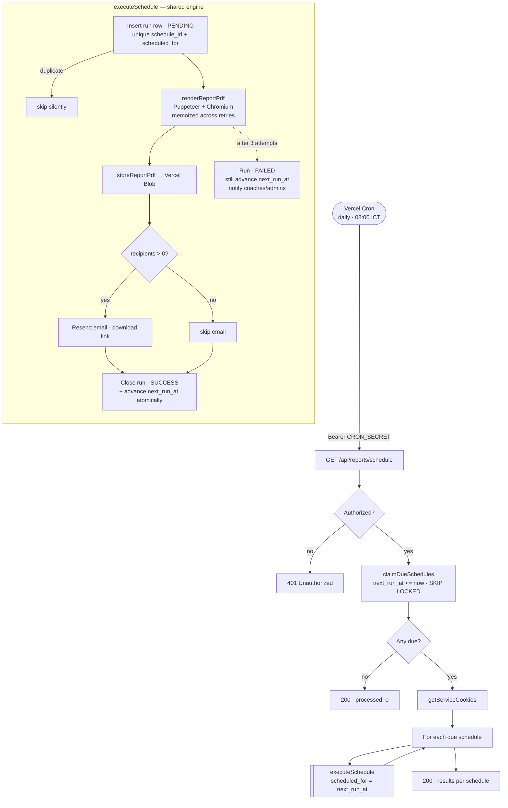

> Route: `/reports` · Nav group: **Overview** · Status: **Draft**

Companion to the [Dashboard](/docs/features/dashboard) spec. The Dashboard renders analytics
and produces PDFs on demand (see Dashboard §5 — _PDF Reports_, Phases 1–2). This
page covers **scheduling** those reports and the **history** of what was generated.

## 1. Summary

- The **Reports** page lets authorized users configure recurring report schedules
  (time range + recipients) and review the history of generated reports.
- A **cron trigger** generates due reports using the same rendering engine as the
  on-demand Dashboard download, stores each PDF, and emails recipients a
  download link.

## 2. Goals / Metrics

### Goals

- Deliver analytics to stakeholders automatically, without a manual download.
- Give a single place to audit what was generated, when, and whether it succeeded.

### Metrics

- Number of schedules active per team.
- Cron success rate (successful runs ÷ due runs).
- Time from "due" to "email delivered".

## 3. Users & Permissions

Access is governed by the `reports` resource.

| Action           | Capability                          |
| ---------------- | ----------------------------------- |
| `view`           | See schedules and generation history |
| `create` / `edit`| Add, update, toggle, or run a schedule now |
| `delete`         | Remove a schedule                   |

> The cron endpoint is not user-facing; it is authorized by a `CRON_SECRET`
> Bearer token, and reports render under a service-account session.

## 4. UX / Flows

### Entry point

- Sidebar → **Reports**.

### Schedules

- A table lists each schedule's time duration, cadence ("Weekly · Monday"),
  recipient count, next run, last run, and an enable/disable toggle. Rows open
  an editor (interval + frequency + day + recipients).
- All reports send at a fixed morning hour (around 08:00 ICT) — there is no
  per-schedule time picker, since the cron ticks daily.
- "Run now" generates a report immediately for a schedule under the current
  user's session. It is also the recovery path after a failed scheduled run.

### History

- A table lists generated reports with status, period, trigger, and a download
  link (auth-guarded).

## 5. Functional Requirements

### Phase 3 — Scheduling + reports page _(planned)_

- **FR-12:** Users can configure schedules (frequency, recipients, time range).
- **FR-13:** A cron trigger generates due reports using the same engine.
- **FR-14:** A reports page lists history with status, period, and download link.
- **FR-15:** Failed cron runs are recorded with an error and surfaced in the list.
- **FR-16:** A retention policy deletes old Blobs and marks rows `expired`.

### Scheduling flow

Users pick a `frequency` (weekly / monthly / quarterly) plus a weekday or day
of month (1–28). Quarterly is anchored to calendar quarters — it sends in
January, April, July and October — so its months do not depend on when the
schedule was created. The next occurrence is precomputed into
`next_run_at` (UTC) on every
create/edit/enable. Vercel Cron ticks once a day at 08:00 ICT; the endpoint
claims schedules whose `next_run_at` has passed (`FOR UPDATE SKIP LOCKED`) and
runs each through the shared execution engine. Each run is recorded first
under a unique `(schedule_id, scheduled_for)` key, so an occurrence can never
execute twice; transient failures retry in-process (the PDF is not re-rendered
when only the email failed), and a final failure still advances `next_run_at`
and notifies the coaches/admins.

## 6. Acceptance Criteria (Given/When/Then)

- **AC-3:** Given a schedule whose reporting window has not yet run, when the cron
  endpoint is hit with a valid `CRON_SECRET`, then a report is generated, stored,
  the recipients are emailed a download link, and `last_run_at` is stamped.
- **AC-4:** Given a schedule whose window was already run, when the cron endpoint
  is hit, then it is skipped (`generated: 0` when none are due).
- **AC-5:** Given rendering fails for a due schedule, when the cron runs, then the
  history row is marked `failed` and the run continues for other schedules.
- **AC-6:** Given I lack `reports:create`/`edit`, when I open the page, then I can
  view schedules/history but cannot add, edit, toggle, delete, or run them.

## 7. Technical Appendix

### Cron endpoint

- `GET /api/reports/schedule` — authorized by `Authorization: Bearer CRON_SECRET`,
  fired daily at `0 1 * * *` UTC (08:00 ICT).
- Claims due schedules via `claimDueSchedules()` (`enabled AND next_run_at <=
  now()`, `FOR UPDATE SKIP LOCKED`), acquires service-account cookies, and runs
  each through `executeSchedule(...)` with `scheduled_for = next_run_at` — the
  planned occurrence, never `now()`, so retries produce identical content and
  idempotency keys. `maxDuration` set to accommodate Puppeteer cold start plus
  in-process retries.
- Schedules are claimed in small batches and processed until a wall-clock budget
  under `maxDuration` runs out, rather than up to a fixed count, so a slow render
  costs one skipped schedule instead of a timeout mid-run. Anything left over is
  still overdue on the next tick.
- `executeSchedule` never throws; per-schedule outcomes are returned so one
  failure does not abort the batch.

### Delivery webhook

- `POST /api/webhooks/resend` — Svix-signature-verified (secret in
  `RESEND_WEBHOOK_SECRET`). Stamps `delivered` / `bounced` / `complained` onto
  the run that sent the email, keyed by `resend_email_id`.

### Retention

- `GET /api/reports/retention` — deletes expired Blobs and marks their rows
  `expired` (retention window: `RETENTION_DAYS`).

### Data model — `report_schedule` (Phase 3, logical)

- `schedule_id`: uuid
- `team_id`: uuid
- `interval`: enum (data window rendered into the PDF)
- `frequency`: enum [`weekly`, `monthly`, `quarterly`] (user-picked cadence)
- `day_of_week`: int 0–6 (weekly) / `day_of_month`: int 1–28 (monthly and
  quarterly)
- `timezone`: string (default `Asia/Ho_Chi_Minh`)
- `recipients`: string[]
- `enabled`: boolean
- `next_run_at`: timestamp (UTC, precomputed; partial-indexed for the tick)
- `last_run_at`: timestamp (nullable)

### Data model — `report_history` (Phase 3, logical)

- `report_id`: uuid
- `team_id`: uuid
- `schedule_id`: uuid (nullable — null for on-demand runs)
- `scheduled_for`: timestamp (the planned occurrence; unique with
  `schedule_id` — the idempotency gate)
- `interval`: string
- `period`: string
- `trigger`: enum [`manual`, `scheduled`]
- `status`: enum [`pending`, `success`, `failed`, `expired`]
- `attempts`: int / `error`: string (in-process retries, surfaced in the UI)
- `pathname` / `filename`: string (Blob location + download name)
- `resend_email_id` / `delivery_status`: string (from the Resend webhook)
- `started_at` / `completed_at` / `expires_at` / `created_at`: timestamp
